# Tanasob Smart Gym Management System

A university capstone project that digitizes daily gym operations: membership
plans and mock payments, class scheduling with trainer assignment, session
booking and attendance (manual, self, and QR-code check-in), workout and diet
plans with photo attachments, body progress tracking with charts, member↔trainer
messaging, notifications, admin reporting, and an AI assistant chat.

**Live demo:** https://tanasob.flora-app.ir

## Screenshots

Persian (RTL) interface throughout, with a Jalali calendar and light/dark themes.

### Member

| Dashboard | My calendar |
|---|---|
| 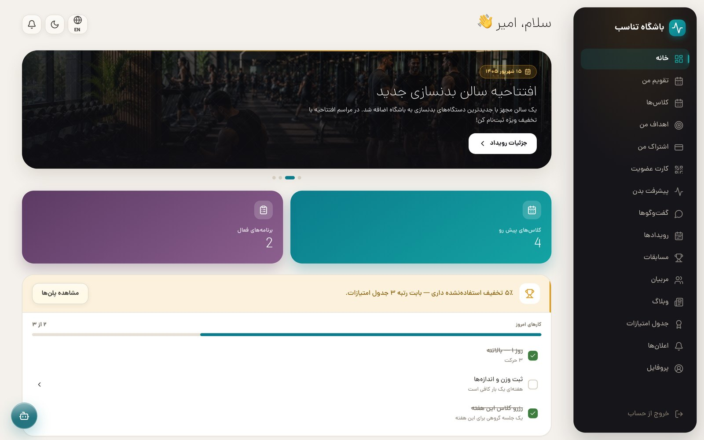 | 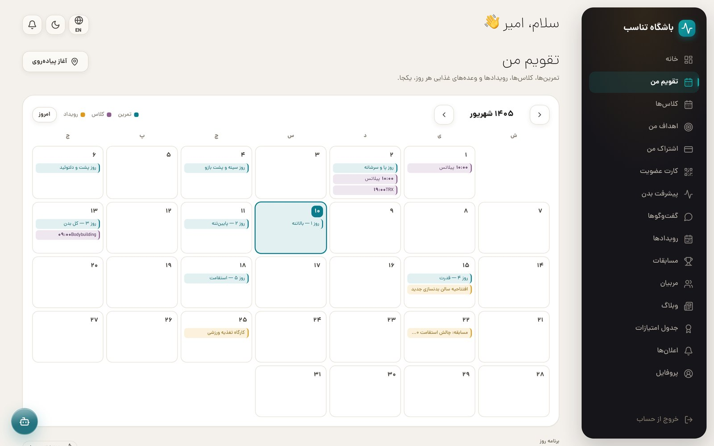 |

Every day shows the member's workout, booked classes, gym events and diet
meals in one Shamsi month view.

| Guided workout | Goals |
|---|---|
| 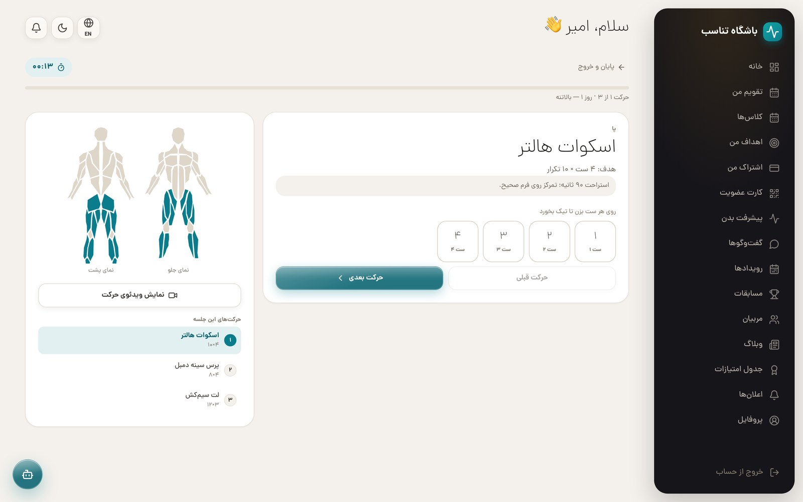 | 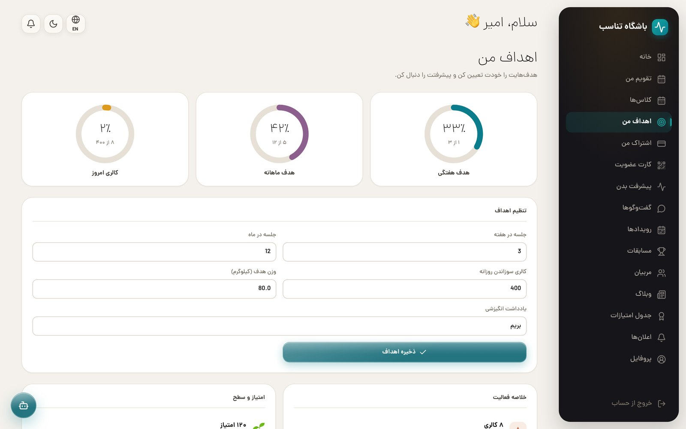 |

The workout runner walks through one exercise at a time with a live timer,
per-set ticks, a rest countdown and the muscle groups being worked. Goals are
set per member rather than shared constants.

| Classes | Class detail |
|---|---|
| 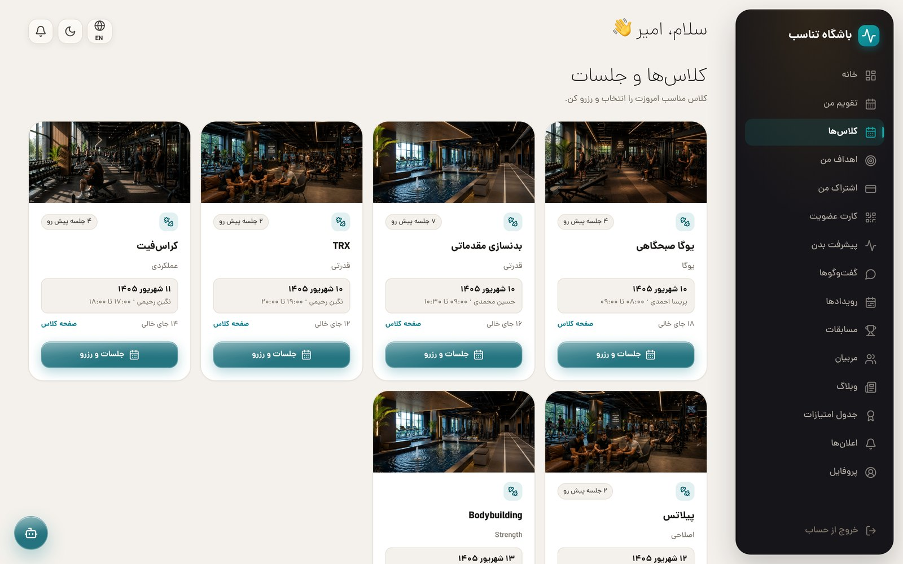 | 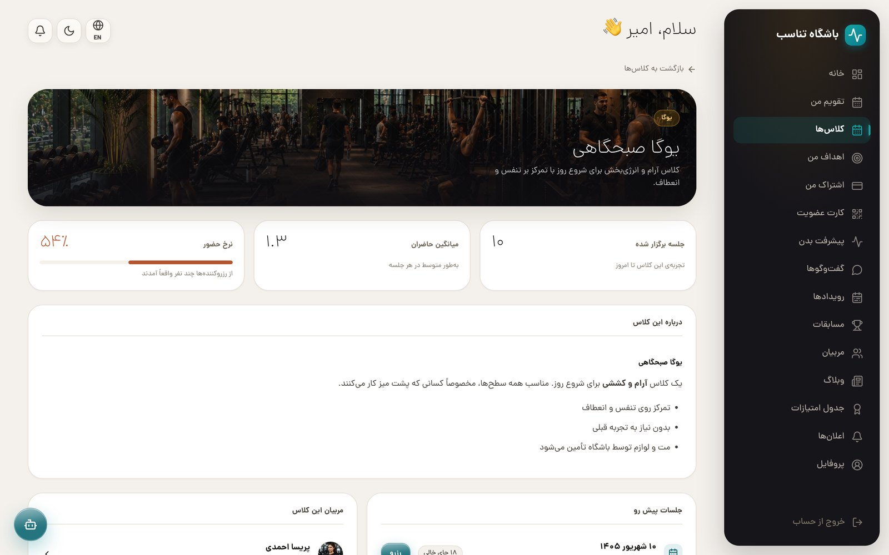 |

Each class has its own page with its trainers, full schedule and a history
panel showing sessions held, average attendance and the real show-up rate.

| Leaderboard & tiers | Trainers |
|---|---|
| 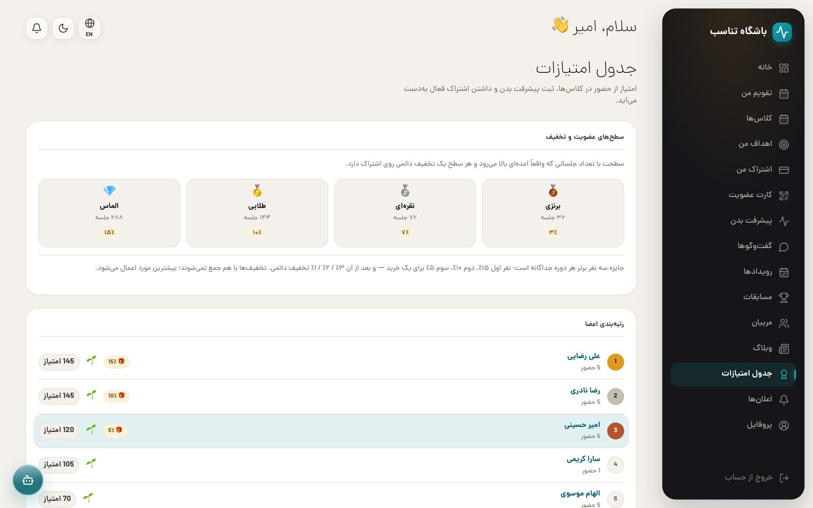 | 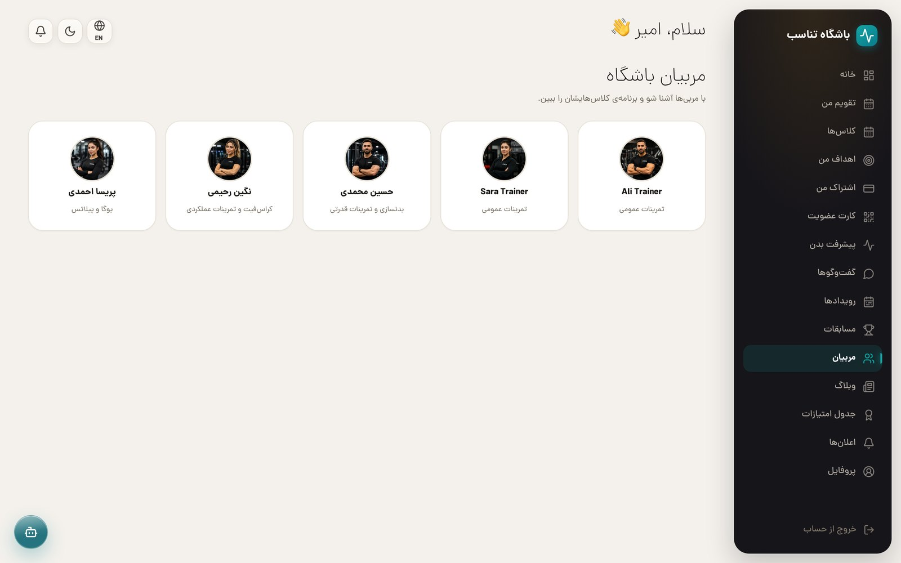 |

Tiers are earned by attendance (36/72/144/288 sessions) and carry a standing
membership discount; the top three of each period get a one-time prize plus a
smaller permanent one. Discounts never stack — the best single one applies.

| Blog | Dark theme |
|---|---|
| 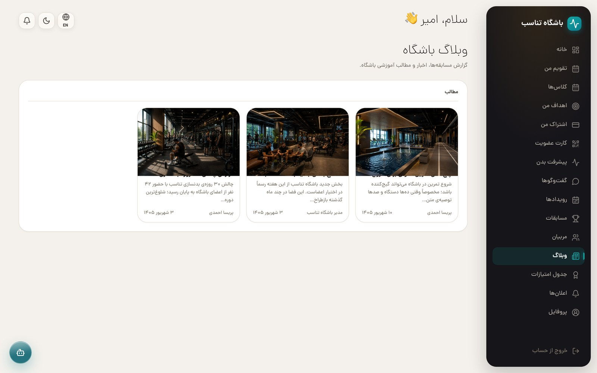 | 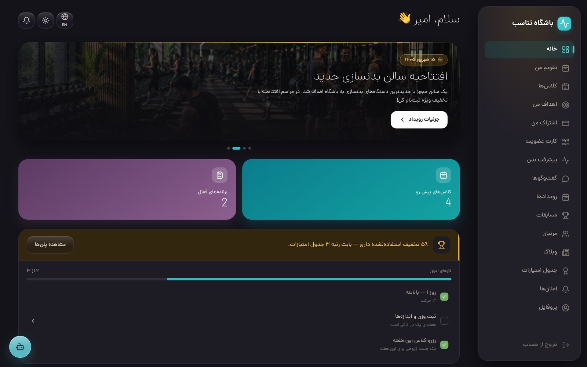 |

### Admin

| Admin panel | Gym-wide calendar |
|---|---|
| 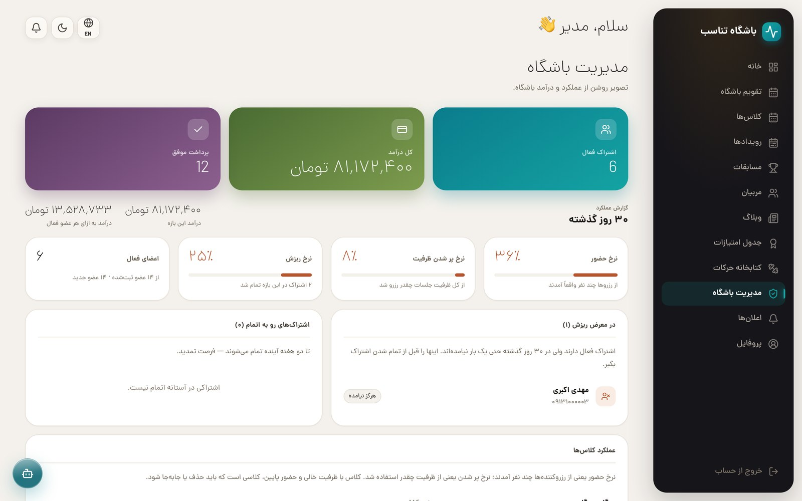 | 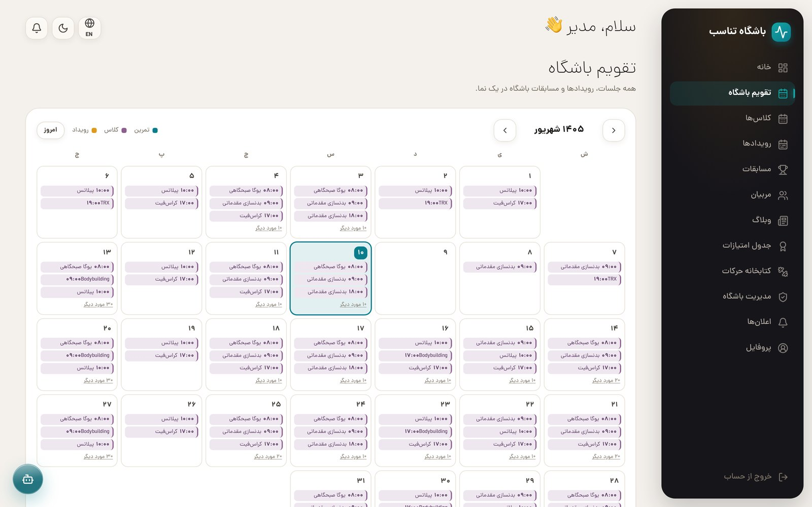 |

There is no Django admin in the product surface — user management, analytics
(attendance rate, churn, ARPU, at-risk members, per-class performance) and the
whole-gym schedule are built into the app itself.

### Public

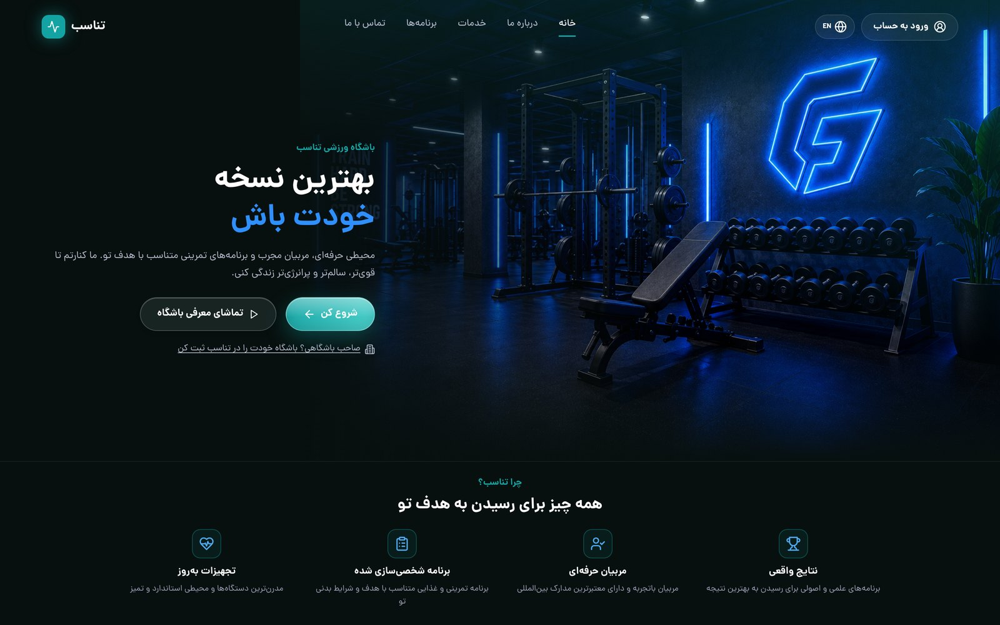


## Project structure

```text
backend/   Django + Django REST Framework API
frontend/  React (Vite) single-page app
deploy/    Host-level nginx config for the production domain
```

## Demo credentials

| Role | Email | Password |
|---|---|---|
| Admin | `admin@tanasob.ir` | `admin123` |
| Admin | `amin@tanasob.com` | `amin123` |
| Trainer | `parisa@tanasob.ir` | `trainer123` |
| Member | `ali.rezaei@tanasob.ir` | `member123` |
| Member | `amir@tanasob.com` | `amir123` |

> **Note on the live demo:** this repository is public, so these credentials
> are effectively public too. That's fine for reviewing seed/demo data, but
> don't put anything sensitive into these accounts on the live deployment —
> anyone who finds this repo can log in with them, including as admin.

## Run locally

**Backend:**

```bash
cd backend
python -m venv .venv
source .venv/bin/activate
pip install -r requirements.txt
cp .env.example .env
python manage.py migrate
python manage.py seed          # base Persian demo data
python manage.py seed_amir     # optional: a member with data in every section
python manage.py seed_amin     # optional: the second admin account above
python manage.py runserver
```

Swagger UI: `http://127.0.0.1:8000/api/docs/`

**Frontend** (second terminal, after the backend is running):

```bash
cd frontend
cp .env.example .env
npm install
npm run dev
```

Open `http://127.0.0.1:5173`. The Vite dev server proxies `/api` to the local
Django server — no Docker needed for day-to-day development.

## Deploy with Docker

```bash
cp backend/.env.example backend/.env
# fill in AI_LLM_* (enables the AI chat) and DJANGO_SECRET_KEY (required —
# see Security below) in backend/.env
docker compose build
docker compose up -d
```

- App: `http://<server>:30080/` — the only port that needs to be reachable;
  the frontend's nginx proxies `/api/`, `/admin/`, `/static/`, and `/media/`
  to the backend container, so the browser only ever talks to one origin.
- API directly: `http://<server>:30081/api/docs/`

Ports are `30080`/`30081` on purpose (not the more common `8000`–`8013`
range). The backend image ships with whatever `backend/db.sqlite3` exists on
the host at build time (see Demo credentials above); it is **not** persisted
across `docker compose build` rebuilds since it's baked in, not volume-mounted
— copy a fresh one over before rebuilding if you want to keep changes.

### Domain + HTTPS (production)

`docker-compose.yml` locks `ALLOWED_HOSTS`/`CSRF_TRUSTED_ORIGINS` to
`tanasob.flora-app.ir`. To put this behind that domain on a VPS:

```bash
sudo cp deploy/tanasob.conf /etc/nginx/sites-available/tanasob.conf
sudo ln -s /etc/nginx/sites-available/tanasob.conf /etc/nginx/sites-enabled/
sudo nginx -t && sudo systemctl reload nginx
sudo certbot --nginx -d tanasob.flora-app.ir
```

Once certbot confirms HTTPS is live, set `HTTPS_ENABLED=True` in
`docker-compose.yml`'s backend environment and redeploy — this turns on
HSTS, HTTPS redirects, and secure-only cookies. It defaults to `False` so a
fresh deploy isn't locked out before HTTPS actually works.

## Security

- `DEBUG=False` in the Docker deployment; the app refuses to start with
  `DEBUG=False` on the default `SECRET_KEY` (it's committed to this repo, so
  it isn't actually secret) — set a real one in `backend/.env`.
- JWT auth (short-lived access token, rotating refresh token, blacklist on
  rotation); role-based permissions enforced on every endpoint.
- `ALLOWED_HOSTS` and `CSRF_TRUSTED_ORIGINS` locked to the real domain.
- Passwords hashed via Django's default PBKDF2; DRF request throttling
  (60/min anonymous, 300/min authenticated) as a basic brute-force/abuse
  guard.
- nginx security headers (`X-Content-Type-Options`, `X-Frame-Options`,
  `Referrer-Policy`); optional HSTS/secure-cookies/HTTPS-redirect once
  `HTTPS_ENABLED=True` (see above).
- Uploaded images capped at 5MB and validated as real images (not just by
  file extension).
- Do not commit `.env`, `db.sqlite3`, private keys, or real credentials —
  `.env.example` is the safe template for both `backend/` and `frontend/`.

## What's intentionally out of scope

Proactive notifications (reminding a member before their subscription
expires, or before an upcoming session) would need real scheduling
infrastructure (cron/Celery) that wasn't worth the added complexity for this
project's scope — notifications are currently reactive only (on booking and
new messages). No real payment gateway, no native mobile app, no
multi-tenant/multi-branch support.
